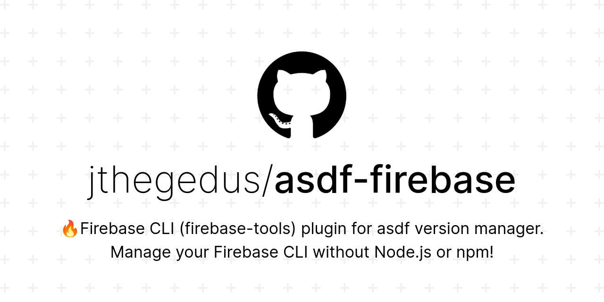

<div align="center">

# asdf-firebase   [](https://github.com/jthegedus/awesome-firebase)

[Firebase CLI](https://firebase.google.com/) [(firebase-tools)](https://github.com/firebase/firebase-tools) plugin for [asdf version manager](https://asdf-vm.com). Manage your Firebase CLI without Node.js or npm global installs! Great for pinning your firebase version across the team and for `python`, `golang`, `c++` & `java` Firebase projects.



</div>

# Contents

- [Dependencies](#dependencies)
- [Install](#install)
- [Why?](#why)
- [Contributing](#contributing)
- [License](#license)

# Dependencies

Are tracked in [lib/dependencies.txt](lib/dependencies.txt) and checked on installation of plugin and `asdf install gcloud *`. The core dependencies are: `bash`, `curl`, `git`, `grep`, `uname`.

# Install

Plugin:

```shell
# prefer the git url method
asdf plugin add https://github.com/jthegedus/asdf-firebase.git
# or
asdf plugin add firebase
```

Install [`firebase-tools`](https://github.com/firebase/firebase-tools):

```shell
asdf install firebase latest
```

Set global version:

```shell
asdf global firebase 7.15.1
```

or if [](https://github.com/asdf-vm/asdf/pull/633) is merged, set the **latest installed** version:

```shell
asdf global firebase latest
```

These commands also apply to `asdf local gcloud <version>`.

See `.tool-versions` configuration in the [asdf](https://asdf-vm.com/#/core-configuration?id=tool-versions) documentation to manage all your project's tools in one place!

# Why?

`firebase-tools` is a CLI tool for all Firebase projects, regardless of language. To date, the methods for installation have been downloading the CLI from the Firebase website or through `npm`, with `npm` being the primary method advertised.

With `asdf` and the `asdf-firebase` plugin, users/teams of any Firebase project can install and pin the version of the Firebase CLI without needing to manage Node.js or `npm`!

# Contributing

Contributions of any kind welcome! See the [contributing guide](contributing.md).

[Thanks goes to these contributors](https://github.com/jthegedus/asdf-firebase/graphs/contributors)!

## Why are there Node deps here?

I decided the value of [commitlint](https://commitlint.js.org/#/) & sharing Git Hooks with [husky](https://typicode.github.io/husky/#/) were greater than the cost of including these deps. Not only this, but dogfooding `asdf` for dev deps makes this less of an issue.

# License

[MIT License](LICENSE) © [James Hegedus](https://github.com/jthegedus/)
